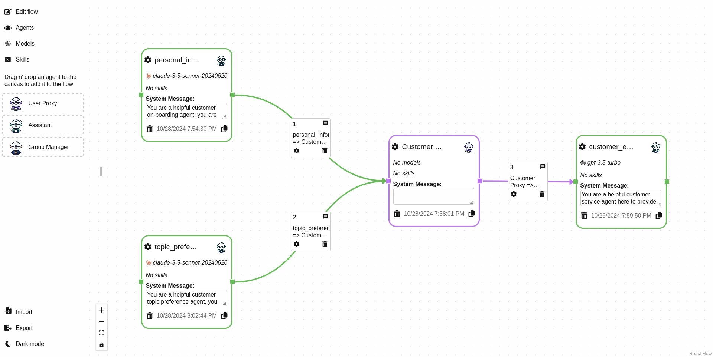

# Waldiez

[](https://badge.fury.io/py/waldiez)

## Make AI Agents Collaborate: Drag, Drop, and Orchestrate with Waldiez



```mermaid
%%{init: {'sequence': {'actorSpacing': 10, 'width': 150}}}%%
sequenceDiagram
    participant customer_engagement_agent as Customer Engagement Agent
    participant customer_proxy as Customer Proxy
    participant topic_preference_agent as Topic Preference Agent
    participant personal_information_agent as Personal Information Agent
    personal_information_agent->>customer_proxy: Hello, I'm here to help you get started with our product. Could you tell me your name and location?
    customer_proxy->>personal_information_agent: 
    note over personal_information_agent: Content: Hi, I'm Stella from Athens
    topic_preference_agent->>customer_proxy: Great! Could you tell me what topics you are interested in reading about?<br/>Context: <br/>{'name':...
    customer_proxy->>topic_preference_agent: 
    note over topic_preference_agent: Content: Software agents
    customer_proxy->>customer_engagement_agent: Let's find something fun to read.<br/>Context: <br/>{'name': 'Stella', 'location': 'Athens'}<br/>{"t...
    customer_engagement_agent->>customer_proxy: Hey Stella from Athens! Did you know that software agents are like little digital helpers that can p...
```

## Installation

On PyPI:

```bash
python -m pip install waldiez
```

## Usage

### UI Options

- For creating-only (no exporting or running) waldiez flows, you can use the playground at <https://waldiez.github.io>.
The repo for the js library is [here](https://github.com/waldiez/react).
- There is also a jupyterlab extension [here](https://github.com/waldiez/jupyter)
- You also can use the vscode extension:
  - [repo](https://github.com/waldiez/vscode)
  - [marketplace](https://marketplace.visualstudio.com/items?itemName=Waldiez.waldiez-vscode)
- Finally, you can use [waldiez-studio](https://github.com/waldiez/studio), which includes a FastAPI app to handle the conversion and running of waldiez flows.

The jupyterlab extension and waldiez studio are also provided as extras in the main package.

```shell
pip install waldiez[studio]  # or pip install waldiez_studio
pip install waldiez[jupyter]  # or pip install waldiez_jupyter
# or both
pip install waldiez[studio,jupyter]
```

### Using docker/podman

We provide three ways to use the Waldiez using docker/podman:

- Using the core python package to convert and run waldiez flows (image: `waldiez/waldiez`)
- Using the jupyter extension (image: `waldiez/waldiez-jupyter`) (this starts a jupyterlab server)
- Using waldiez-studio (image: `waldiez/waldiez-studio`) (this starts a FastAPI server)

```shell
CONTAINER_COMMAND=docker # or podman
# pull the image
$CONTAINER_COMMAND pull waldiez/waldiez
# Convert a Waldiez flow to a python script or a jupyter notebook
$CONTAINER_COMMAND run \
  --rm \
  -v /path/to/a/flow.waldiez:/flow.waldiez \
  -v /path/to/an/output:/output \
  waldiez/waldiez convert --file /flow.waldiez --output /output/flow[.py|.ipynb] [--force]

# with selinux and/or podman, you might get permission (or file not found) errors, so you can try:
$CONTAINER_COMMAND run \
  --rm \
  -v /path/to/a/flow.waldiez:/flow.waldiez \
  -v /path/to/an/output:/output \
  --userns=keep-id \
  --security-opt label=disable \
  waldiez/waldiez convert --file /flow.waldiez --output /output/flow[.py|.ipynb] [--force]
```

```shell
# Convert and run the script
$CONTAINER_COMMAND run \
  --rm \
  -v /path/to/a/flow.waldiez:/flow.waldiez \
  -v /path/to/an/output:/output \
  waldiez/waldiez run --file /flow.waldiez --output /output/output[.py]
```

Repos (submodules) included in this repo:

- [packages/core/python](https://github.com/waldiez/python) is the core python package to convert and run waldiez flows.
- [packages/core/react](https://github.com/waldiez/react) is the core react package to create and visualize waldiez flows.
- [packages/jupyter](https://github.com/waldiez/jupyter) is a jupyter extension that combines the core python and react packages.
- [packages/vscode](https://github.com/waldiez/vscode) is a vscode extension that combines the core python and react packages.
- [packages/studio](https://github.com/waldiez/studio) is a web app that combines the core python and react packages.
- [examples](https://github.com/waldiez/examples) is a collection of exported waldiez flows.
- [package_templates](https://github.com/waldiez/package_templates) is a collection of templates for the projects in this repo.

## License

This project is licensed under the [Apache License, Version 2.0 (Apache-2.0)](https://github.com/waldiez/waldiez/blob/main/LICENSE).
